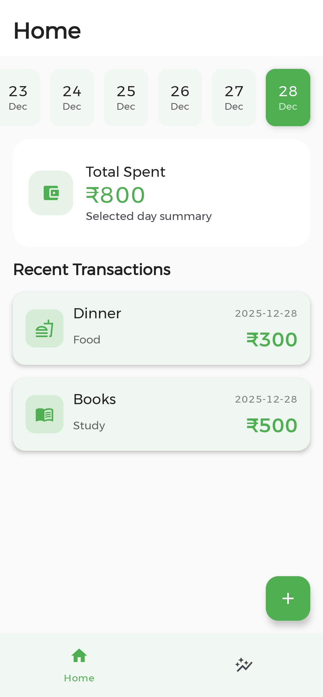
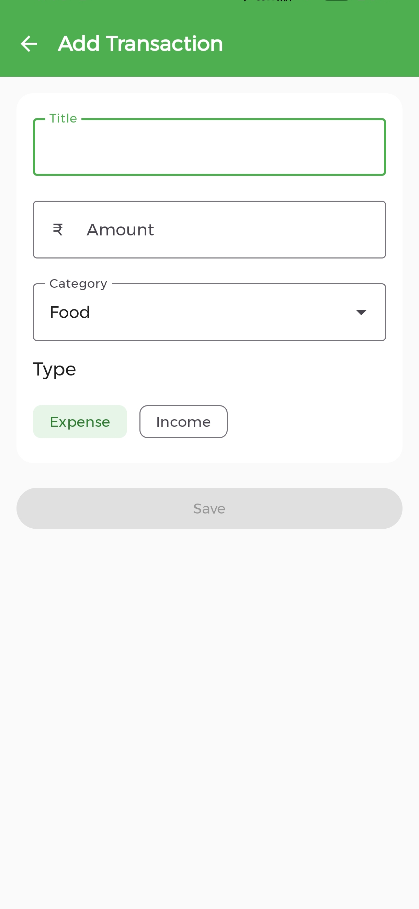
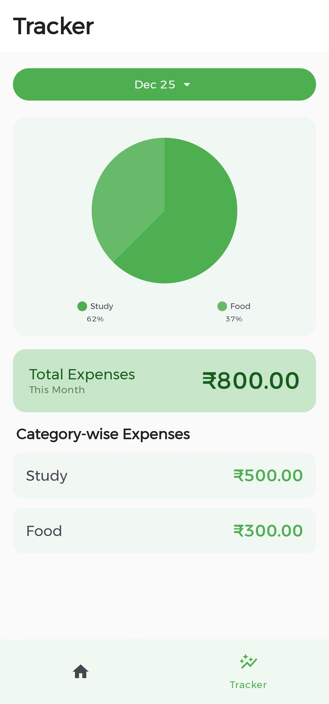

# Expense Tracker App

Expense Tracker is an Android application that helps users record, manage, and analyze their daily expenses in a simple and organized way.

## About App

The app allows users to add expenses with details such as item name, category, amount, and date. Users can view their expense history in a structured list and analyze spending patterns using visual summaries and charts. The application focuses on clean UI, smooth user experience, and reliable local data storage.

## Features

- Add daily expenses with category, amount, and date
- View expense history in an organized list
- Track spending using visual charts and summaries
- Clean and modern user interface
- Light and Dark theme support
- Offline data storage using local database

## App UI

## Tech Stack

- Kotlin
- Android SDK
- MVVM Architecture
- Room Database
- Jetpack Components
- Material Design

## Purpose

This project is built to practice and demonstrate modern Android development concepts such as proper architecture, data handling, and UI design. It is suitable for learning, portfolio showcase, and internship applications.

